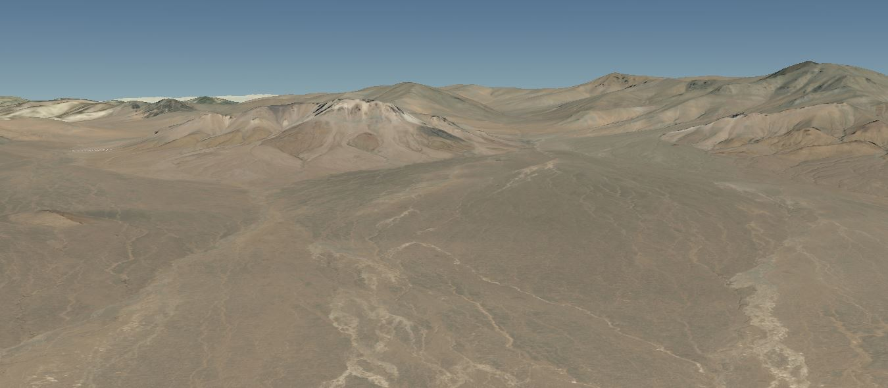
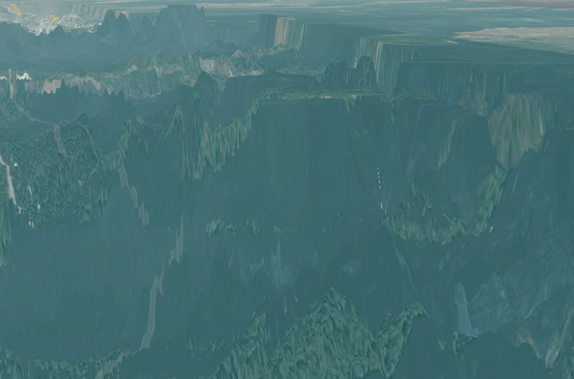
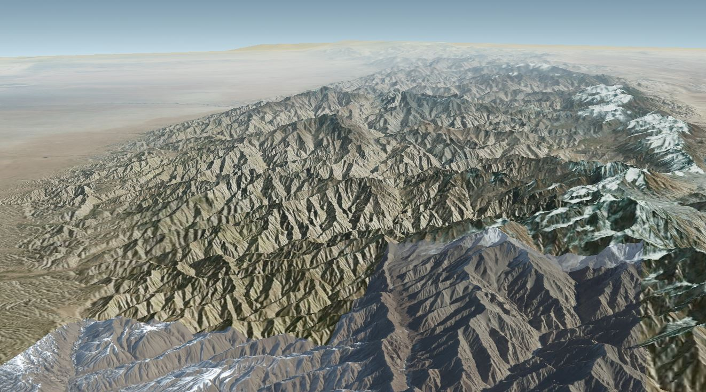

# 地形使用实例

## arcgisTerrain

```js
addTerrain(
  "arcgisTerrain",
  "https://elevation3d.arcgis.com/arcgis/rest/services/WorldElevation3D/Terrain3D/ImageServer",
  {
    key:
      "KED1aF_I4UzXOHy3BnhwyBHU4l5oY6rO6walkmHoYqGp4XyIWUd5YZUC1ZrLAzvV40pR6gBXQayh0eFA8m6vPg.."
  }
)
```



## cesiumTerrain

```js
addTerrain(
  "cesiumTerrain",
  "http://localhost:8091/jiuzhaigou"
)
```

  
**在使用自己的地形服务之前一定要注意DEM的配准**

## ionTerrain

```js
addTerrain("ionTerrain")
```


