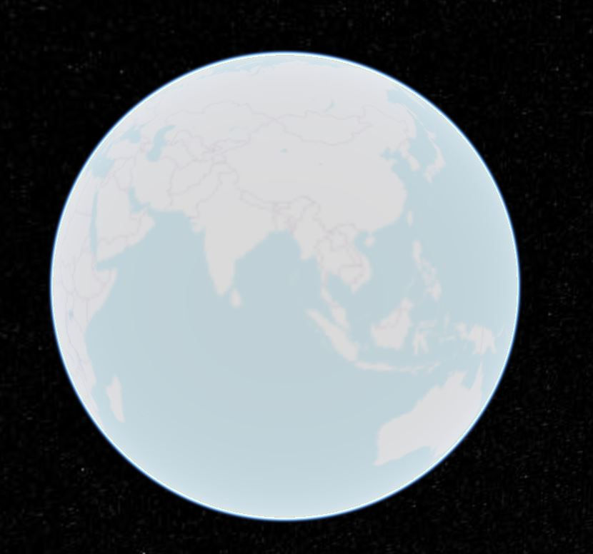

# 图层使用实例

## arcgis

```js
createImageryProvider(
  "arcgis",
  "https://map.geoq.cn/ArcGIS/rest/services/ChinaOnlineStreetPurplishBlue/MapServer"
)
```


## bing

```js
createImageryProvider("bing", "https://dev.virtualearth.net", {
  key: "AmXdbd8UeUJtaRSn7yVwyXgQlBBUqliLbHpgn2c76DfuHwAXfRrgS5qwfHU6Rhm8"
})
```


## grid

```js
createImageryProvider("grid")
```


## mapbox

```js
createImageryProvider("mapbox", "", {
  mapId: "satellite",
  accessToken:"pk.eyJ1IjoibHM4NzAwNjEwMTEiLCJhIjoiY2tqYXZlZ2JrMDI5bTJzcDJmdDNteGhsNy0wTn4B1ce9Q4U5GnPso5iA"
})
```


## mapboxStyle

```js
createImageryProvider("mapboxStyle", "", {
  styleId: "dark-v10",
  accessToken:"pk.eyJ1IjoibHM4NzAwNjEwMTEiLCJhIjoiY2tqYXZlZ2JrMDI5bTJzcDJmdDNteGhsNy0wTn4B1ce9Q4U5GnPso5iA"
})
```


## osm

```js
createImageryProvider("osm")
```



## singleTile

```js
createImageryProvider("singleTile", require("@/assets/cat.jpg"), {
  rectangle: [0, 0, 0, 0]
})
```


## tileCoordinates

```js
createImageryProvider("tileCoordinates")
```


## urlTemplate

```js
createImageryProvider(
  "urlTemplate",
  "http://{s}.tile.openstreetmap.org/{z}/{x}/{y}.png"
)
```


## wms

```js
createImageryProvider("wms", "http://localhost:8090/geoserver/topp/wms", {
  layer: "topp:states"
})
```


## wmts

```js
createImageryProvider(
  "wmts",
  "http://t0.tianditu.gov.cn/img_w/wmts?tk=c0b9cb30599dd11c468c8aaa2fc1863a",
  {
    layer: "img",
    format: "image/jpeg",
    tileMatrixSetID: "w"
  }
)
```


```js

createImageryProvider(
  "wmts",
  "http://localhost:8090/geoserver/gwc/service/wmts",
  {
    layer: "topp:states",
    format: "image/png",
    style: "population",
    tileMatrixSetID: "EPSG:4326",
    tilingScheme: [2, 1],
    matrixIds: [
      "EPSG:4326:0",
      "EPSG:4326:1",
      "EPSG:4326:2",
      "EPSG:4326:3",
      "EPSG:4326:4",
      "EPSG:4326:5",
      "EPSG:4326:6",
      "EPSG:4326:7",
      "EPSG:4326:8",
      "EPSG:4326:9",
      "EPSG:4326:10",
      "EPSG:4326:11",
      "EPSG:4326:12",
      "EPSG:4326:13",
      "EPSG:4326:14",
      "EPSG:4326:15",
      "EPSG:4326:16",
      "EPSG:4326:17",
      "EPSG:4326:18",
      "EPSG:4326:19",
      "EPSG:4326:20",
      "EPSG:4326:21"
    ],
    rectangle: [-124.73142200000001, 24.955967, -66.969849, 49.371735]
  }
)

```


