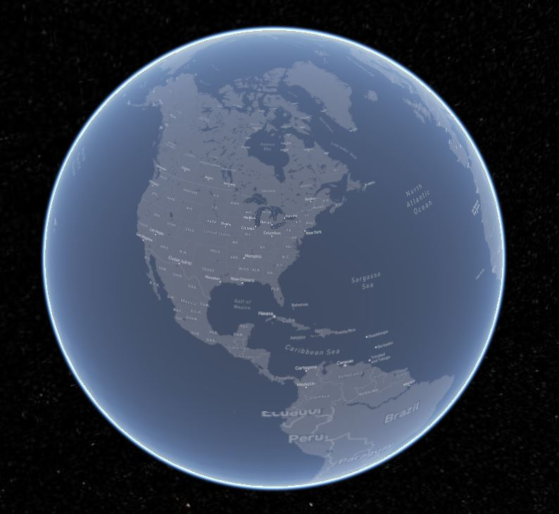

# 地图类型

## arcgis地图

| 名称 | 描述 |
|:---: | :---: |
|http://map.geoq.cn/ArcGIS/rest/services/ChinaOnlineCommunity/MapServer||
|http://map.geoq.cn/ArcGIS/rest/services/ChinaOnlineStreetWarm/MapServer||
|http://map.geoq.cn/arcgis/rest/services/ChinaOnlineStreetGray/MapServer||
|http://map.geoq.cn/arcgis/rest/services/ChinaOnlineStreetPurplishBlue/MapServer||
|http://thematic.geoq.cn/arcgis/rest/services/ThematicMaps/WorldHydroMap/MapServer||

## bing地图

| 名称 | 描述 |
|:---: | :---: |
|AERIAL|航空影像(访问不到地图)|
|AERIAL_WITH_LABELS|带有道路标记的航空影像图(访问不到地图)|
|AERIAL_WITH_LABELS_ON_DEMAND||
|ROAD|道路图(访问不到地图)|
|ROAD_ON_DEMAND||
|CANVAS_DARK||
|CANVAS_LIGHT||
|CANVAS_GRAY||
|ORDNANCE_SURVEY|地形图形,只有英国地区可见(访问不到地图)|
|COLLINS_BART|柯林斯巴特图像(访问不到地图)|  
**bingKey: AmXdbd8UeUJtaRSn7yVwyXgQlBBUqliLbHpgn2c76DfuHwAXfRrgS5qwfHU6Rhm8**
**bingUrl: 'https://dev.virtualearth.net'**
**不建议使用bing地图,访问地图很慢!网络问题**
  
## mapbox地图

| 名称 | 描述 |
|:---:|:---:|
|satellite||
**mapbox的accessToken: pk.eyJ1IjoibHM4NzAwNjEwMTEiLCJhIjoiY2tqYXZlZ2JrMDI5bTJzcDJmdDNteGhsNyJ9.0wTn4B1ce9Q4U5GnPso5iA**
**mapbox已经不支持基础地图服务,但是支持自己发布的一些地图**

## mapboxStyle地图

| 名称 | 描述 |
|:---:|:---:|
|streets-v11||
|outdoors-v11||
|light-v10||
|dark-v10||
|satellite-v9||
**mapboxStyle的accessToken: pk.eyJ1IjoibHM4NzAwNjEwMTEiLCJhIjoiY2tqYXZlZ2JrMDI5bTJzcDJmdDNteGhsNyJ9.0wTn4B1ce9Q4U5GnPso5iA**
