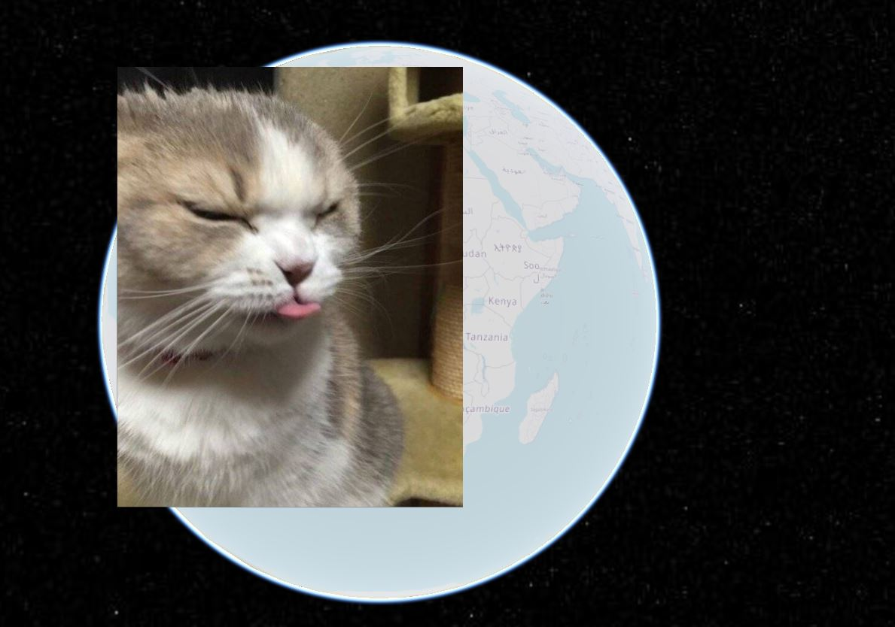
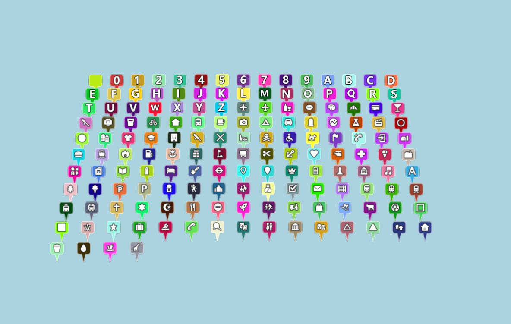
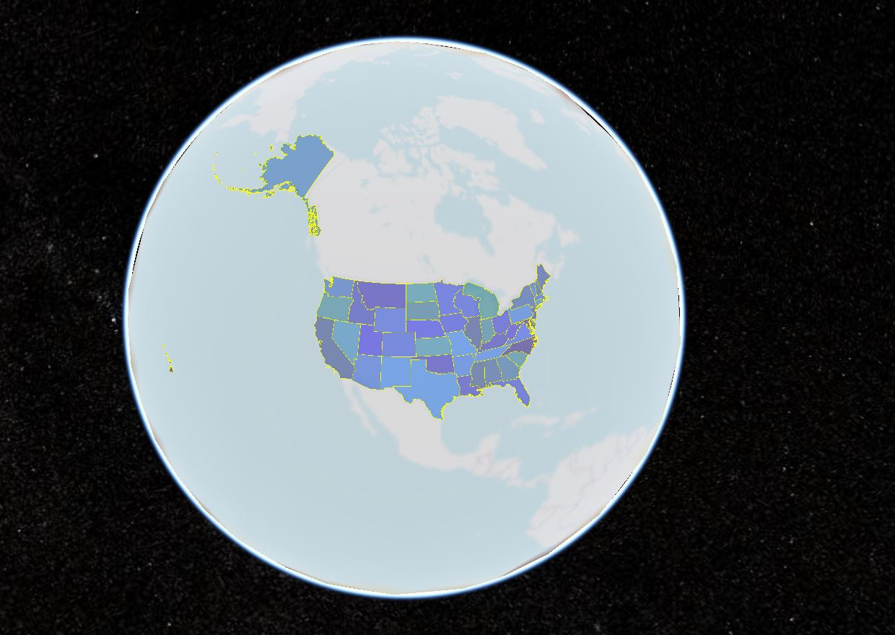
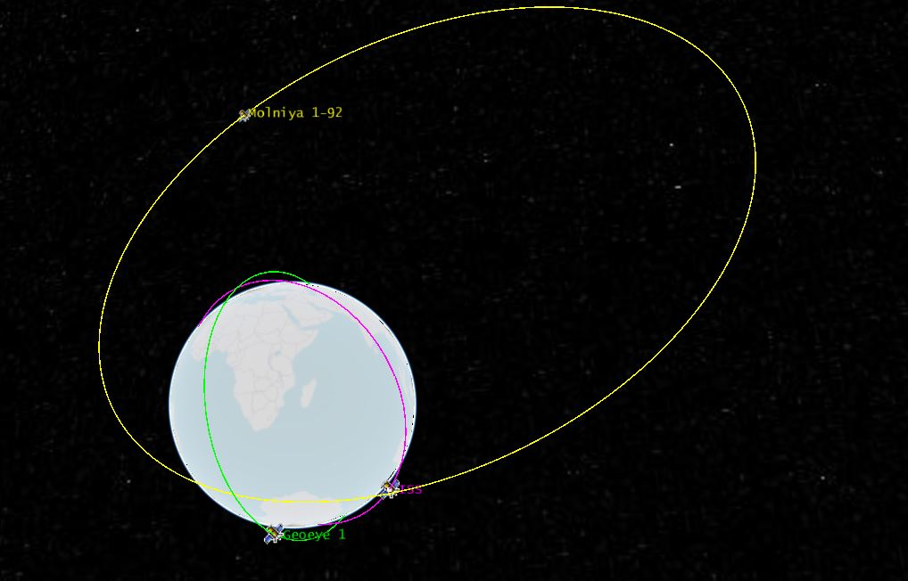
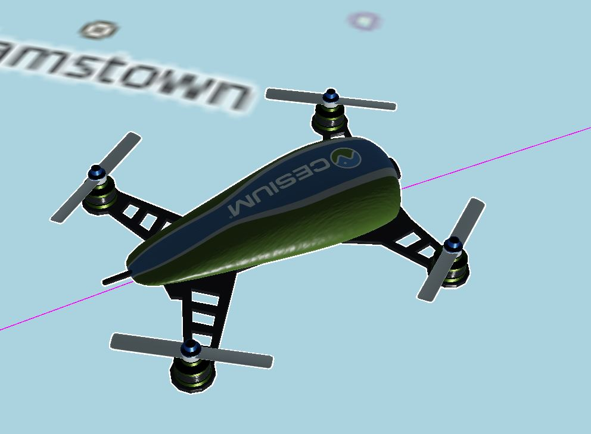

# dataSource加载示例展示

## customDataSource

```js
let dataSource = createDataSource("customDataSource", "myData");
dataSource.entities.add({
  position: this.Cesium.Cartesian3.fromDegrees(1, 2, 0),
  billboard: {
    image: require("../assets/cat.jpg")
  }
});
window.viewer.dataSources.add(dataSource);
```



## GeoJsonDataSource

```js
let dataSource = createDataSource(
  "json",
  "http://localhost:8091/SampleData/simplestyles.geojson",
  {
    clampToGround: true
  }
);
dataSource.then(res => {
  window.viewer.dataSources.add(res);
  window.viewer.zoomTo(dataSource);
});
```



## topojson

```js
let dataSource = createDataSource(
  "json",
  "http://localhost:8091/SampleData/ne_10m_us_states.topojson"
);
dataSource.then(res => {
  let entities = res.entities.values;
  for (let entity of entities) {
    if (this.Cesium.defined(entity.polygon)) {
      // * 设置材质
      entity.polygon.material = this.Cesium.Color.fromRandom({
        red: 0.1,
        maximumGreen: 0.5,
        minimumBlue: 0.5,
        alpha: 0.5
      });
      // * 多边形对地形和3Dtile进行区分
      entity.polygon.classificationType = this.Cesium.ClassificationType.TERRAIN;
      // * 获取多边形的中心位置
      let polyPositions = entity.polygon.hierarchy.getValue(
        this.Cesium.JulianDate.now()
      ).positions;
      let polyCenter = this.Cesium.BoundingSphere.fromPoints(polyPositions)
        .center;
      polyCenter = this.Cesium.Ellipsoid.WGS84.scaleToGeodeticSurface(
        polyCenter
      );
      entity.position = polyCenter;
      // * 设置实体的文字
      entity.label = {
        text: entity.name,
        showBackground: true,
        scale: 0.6,
        horizontalOrigin: this.Cesium.HorizontalOrigin.CENTER, // * 标签的左右位置
        verticalOrigin: this.Cesium.VerticalOrigin.BOTTOM, // * 标签的垂直位置
        distanceDisplayCondition: new this.Cesium.DistanceDisplayCondition(
          10.0,
          10000000.0
        ), // * 标签离摄像机多远时显示
        disableDepthTestDistance: 100.0
      };
    }
  }
  window.viewer.dataSources.add(res);
});
```



## czml

```js
let dataSource = createDataSource(
  "czml",
  "http://localhost:8091/SampleData/simple.czml"
);
dataSource.then(res => {
  window.viewer.dataSources.add(res);
  let drone = res.entities.getById("Satellite/ISS");
  // * 替换glb
  drone.model = {
    uri:
      "http://localhost:8091/SampleData/models/CesiumDrone/CesiumDrone.glb",
    minimumPixelSize: 128, // * 最小像素大小
    maximumScale: 1000, // * 最大比例尺寸
    silhouetteColor: this.Cesium.Color.WHITE, // * 轮廓颜色
    silhouetteSize: 3 // * 轮廓大小
  };
  // * 计算并设置模型方向
  drone.orientation = new this.Cesium.VelocityOrientationProperty(
    drone.position
  );
  // * 位置插值使运动平滑
  drone.position.setInterpolationOptions({
    interpolationDegree: 3,
    interpolationAlgorithm: this.Cesium.HermitePolynomialApproximation // * 插值算法
  });
});
```




