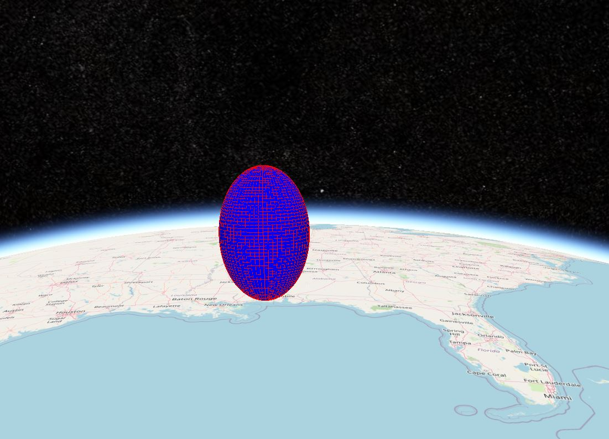
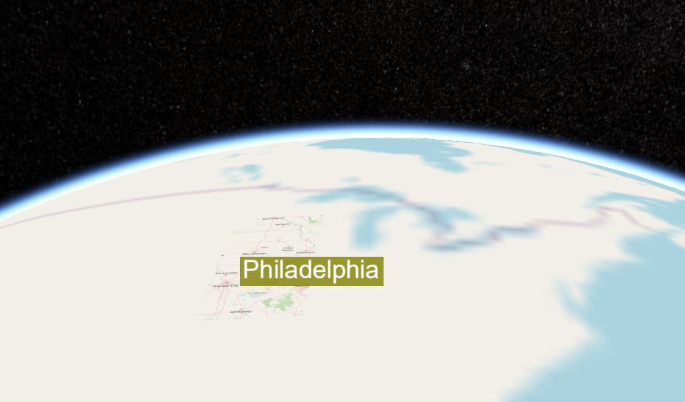
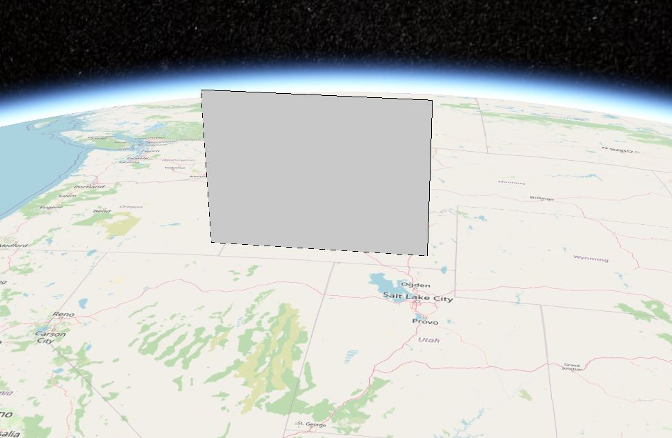
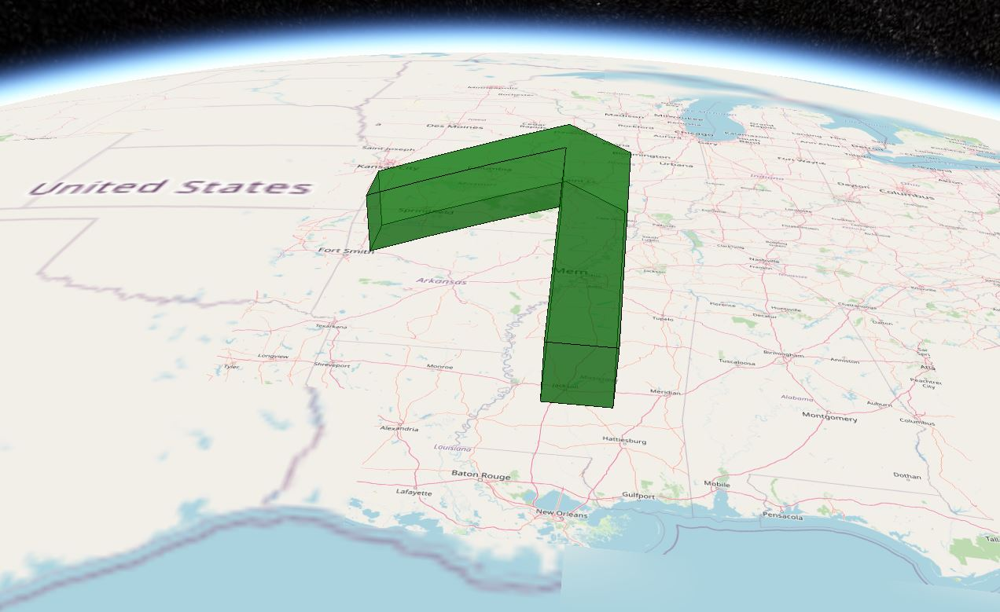
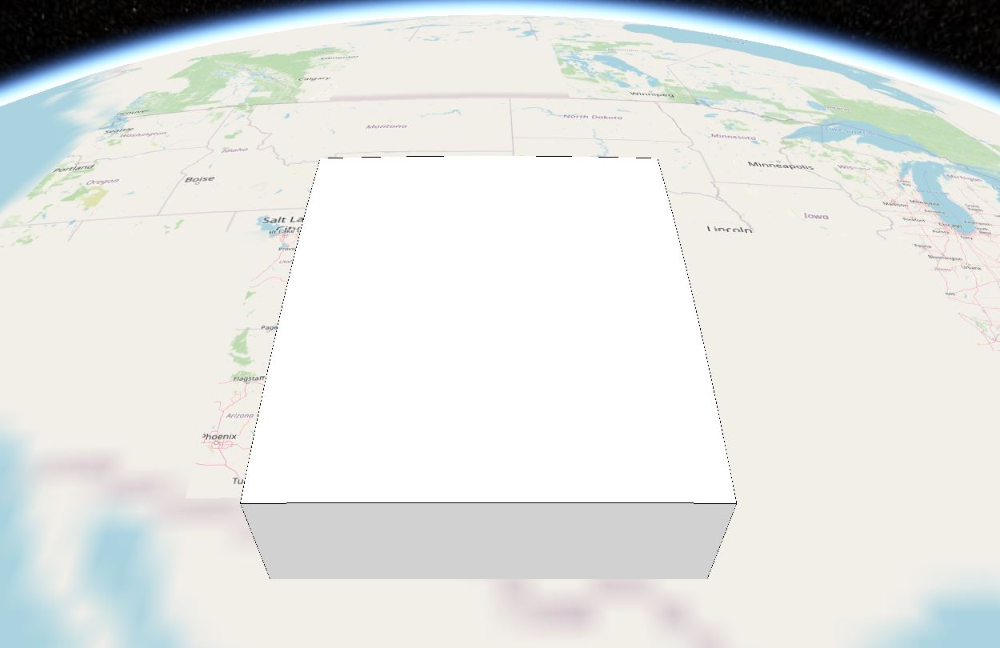
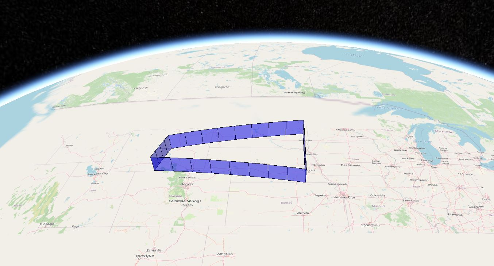
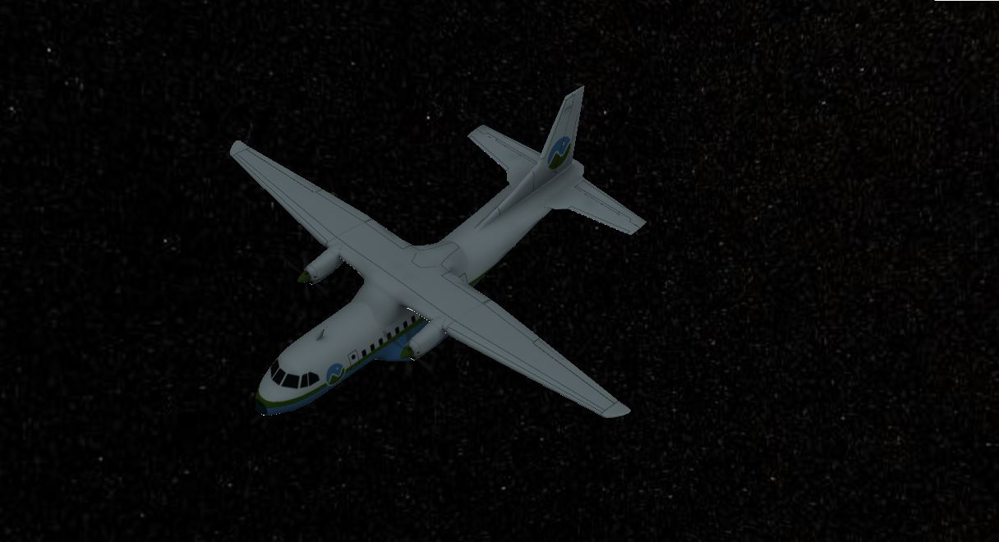
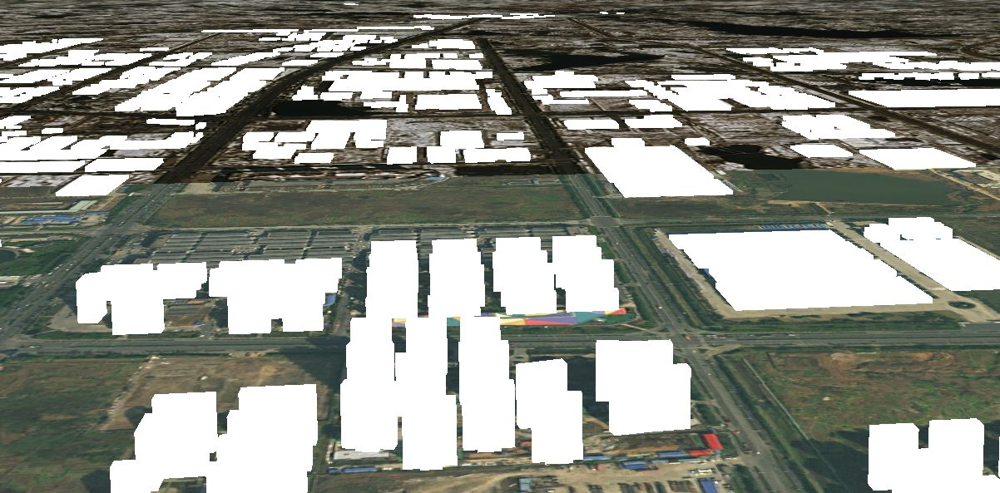

# entity示例展示

## polygon

```js
let entity = createEntity("polygon", {
  name: "entity",
  hierarchy: [
    -109.080842,
    45.002073,
    -105.91517,
    45.002073,
    -104.058488,
    44.996596,
    -104.053011,
    43.002989,
    -104.053011,
    41.003906,
    -105.728954,
    40.998429,
    -107.919731,
    41.003906,
    -109.04798,
    40.998429,
    -111.047063,
    40.998429,
    -111.047063,
    42.000709,
    -111.047063,
    44.476286,
    -111.05254,
    45.002073
  ],
  height: 20000,
  extrudedHeight: 250000,
  material: this.Cesium.Color.RED.withAlpha(0.5),
  outline: true
});
let enti = window.viewer.entities.add(entity);
window.viewer.zoomTo(enti);
```


## point

```js
let entity = createEntity("point", {
  name: "entity",
  position: [-109.080842, 45.002073],
  outlineWidth: 2
});
let enti = window.viewer.entities.add(entity);
window.viewer.zoomTo(enti);
```


## polyline

```js
let entity = createEntity("polyline", {
  positions: [86.787554, 28.034714, 86.391273, 27.939707],
  material: new this.Cesium.PolylineOutlineMaterialProperty({
    color: this.Cesium.Color.ORANGE,
    outlineWidth: 3,
    outlineColor: this.Cesium.Color.RED,
    glowPower: 0.2
  }),
  width: 5,
  clampToGround: true
});
let enti = window.viewer.entities.add(entity);
window.viewer.zoomTo(enti);
```


## billboard

```js
let entity = createEntity("billboard", {
  position: [86.787554, 28.034714],
  image: require("../assets/cat.jpg"),
  show: true,
  pixelOffset: new this.Cesium.Cartesian2(0, -50),
  eyeOffset: new this.Cesium.Cartesian3(0.0, 0.0, 0.0),
  horizontalOrigin: this.Cesium.HorizontalOrigin.CENTER,
  verticalOrigin: this.Cesium.VerticalOrigin.BOTTOM,
  scale: 2.0,
  color: this.Cesium.Color.WHITE,
  rotation: this.Cesium.Math.PI_OVER_FOUR,
  alignedAxis: this.Cesium.Cartesian3.ZERO,
  width: 100,
  height: 100
});
let enti = window.viewer.entities.add(entity);
window.viewer.zoomTo(enti);
```


## box

```js
let entity = createEntity("box", {
  position: [86.787554, 28.034714],
  show: true,
  dimensions: [400000.0, 300000.0, 500000.0],
  material: this.Cesium.Color.BLUE,
  outline: true,
  outlineColor: this.Cesium.Color.RED,
  outlineWidth: 3.0
});
let enti = window.viewer.entities.add(entity);
window.viewer.zoomTo(enti);
```


## corridor

```js
let entity = createEntity("corridor", {
  position: [-90.0, 40.0, -95.0, 40.0, -95.0, 35.0],
  show: true,
  height: 100000.0,
  width: 200000.0,
  extrudedHeight: 120000.0,
  cornerType: this.Cesium.CornerType.BEVELED,
  material: this.Cesium.Color.BLUE,
  outline: true,
  outlineColor: this.Cesium.Color.RED,
  outlineWidth: 3.0
});
let enti = window.viewer.entities.add(entity);
window.viewer.zoomTo(enti);
```


## cylinder

```js
let entity = createEntity("cylinder", {
  position: [-90.0, 40.0, 0],
  show: true,
  length: 100000.0,
  topRadius: 200000.0,
  bottomRadius: 300000.0,
  material: this.Cesium.Color.BLUE,
  outline: true,
  outlineColor: this.Cesium.Color.RED,
  outlineWidth: 3.0
});
let enti = window.viewer.entities.add(entity);
window.viewer.zoomTo(enti);
```


## ellipse

```js
let entity = createEntity("ellipse", {
  position: [-90.0, 40.0, 0],
  show: true,
  semiMajorAxis: 100000.0,
  semiMinorAxis: 50000.0,
  extrudedHeight: 3000.0,
  material: this.Cesium.Color.BLUE,
  outline: true,
  outlineColor: this.Cesium.Color.RED,
  outlineWidth: 3.0
});
let enti = window.viewer.entities.add(entity);
window.viewer.zoomTo(enti);
```


## ellipsoid

```js
let entity = createEntity("ellipsoid", {
  position: [-90.0, 40.0, 0],
  show: true,
  radii: [200000.0, 200000.0, 300000.0],
  material: this.Cesium.Color.BLUE,
  outline: true,
  outlineColor: this.Cesium.Color.RED,
  outlineWidth: 3.0
});
let enti = window.viewer.entities.add(entity);
window.viewer.zoomTo(enti);
```



## label

```js
let entity = createEntity("label", {
  position: [-90.0, 40.0, 0],
  show: true,
  text: "Philadelphia",
  font: "40px Helvetica",
  outlineWidth: 2,
  backgroundColor: new this.Cesium.Color(0.5, 0.5, 0, 0.8),
  showBackground: true
});
let enti = window.viewer.entities.add(entity);
window.viewer.zoomTo(enti);
```



## plane

```js
let entity = createEntity("plane", {
  position: [-114.0, 40.0, 300000.0],
  show: true,
  dimensions: [400000.0, 300000.0], // * 指定平面宽高
  fill: true,
  outline: true,
  outlineWidth: 2
});
let enti = window.viewer.entities.add(entity);
window.viewer.zoomTo(enti);
```



## polylineVolume

```js
let entity = createEntity("polylineVolume", {
  positions: [
    -90.0,
    32.0,
    0.0,
    -90.0,
    36.0,
    100000.0,
    -94.0,
    36.0,
    0.0
  ],
  show: true,
  cornerType: this.Cesium.CornerType.BEVELED,
  material: this.Cesium.Color.GREEN.withAlpha(0.5),
  outline: true,
  outlineColor: this.Cesium.Color.BLACK
});
let enti = window.viewer.entities.add(entity);
window.viewer.zoomTo(enti);
```



## rectangle

```js
let entity = createEntity("rectangle", {
  coordinates: [-110.0, 30.0, -100.0, 40.0],
  extrudedHeight: 300000.0,
  fill: false,
  outline: true,
  outlineWidth: 2.0
});
let enti = window.viewer.entities.add(entity);
window.viewer.zoomTo(enti);
```



## wall

```js
let entity = createEntity("wall", {
  positions: [
    -107.0,
    43.0,
    100000.0,
    -97.0,
    43.0,
    100000.0,
    -97.0,
    40.0,
    100000.0,
    -107.0,
    40.0,
    100000.0,
    -107.0,
    43.0,
    100000.0
  ],
  maximumHeights: [100000, 200000, 100000, 200000, 100000],
  minimumHeights: [0, 100000, 0, 100000, 0],
  fill: false,
  material: this.Cesium.Color.BLUE.withAlpha(0.5),
  outline: true,
  outlineWidth: 2.0
});
let enti = window.viewer.entities.add(entity);
window.viewer.zoomTo(enti);
```



## model

```js
let entity = createEntity("model", {
  positions: [-107.0, 43.0, 0],
  uri:
    "http://localhost:8091/SampleData/models/CesiumAir/Cesium_Air.glb"
});
let enti = window.viewer.entities.add(entity);
window.viewer.zoomTo(enti);
```



## tileset

```js
let entity = createEntity("tileset", {
  uri: "http://localhost:8091/cz/tileset.json"
});
let enti = window.viewer.entities.add(entity);
window.viewer.zoomTo(enti);
```


