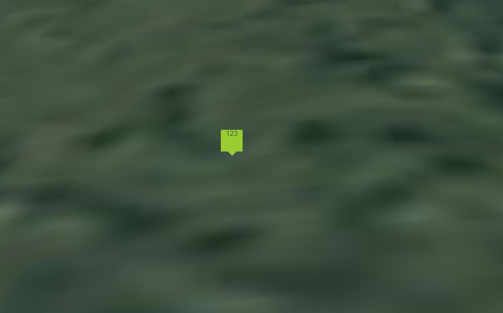

# infoBox加载示例展示

## infoBox

```html
<div class="infoBox">
  <span>123</span>
</div>
```

```js
popFun(new this.Cesium.Cartesian3(-1076075, 5245631, 3453356));
```

```style
.infoBox {
  position: fixed;
  background: yellowgreen;
  width: 50px;
  height: 50px;
  z-index: 1000;
}
.infoBox::after {
  content: "";
  width: 0;
  height: 0;
  border: 10px solid transparent;
  border-top-color: yellowgreen;
  position: absolute;
  left: 16px; /*调整小三角形的位置*/
  top: 100%; /*调整小三角形的位置*/
}
```


