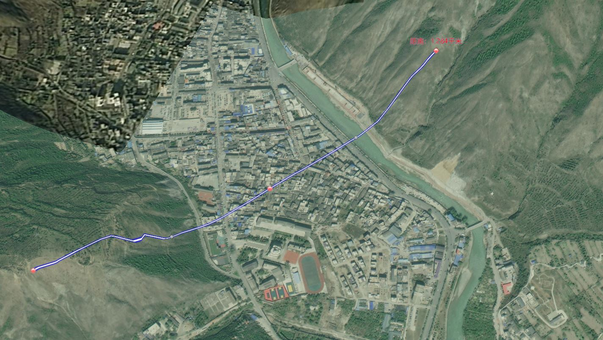
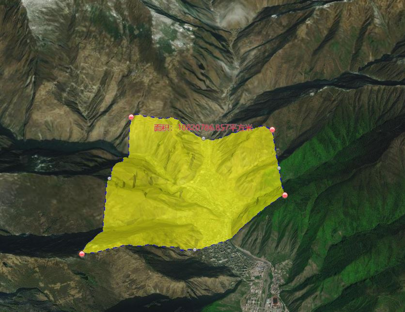
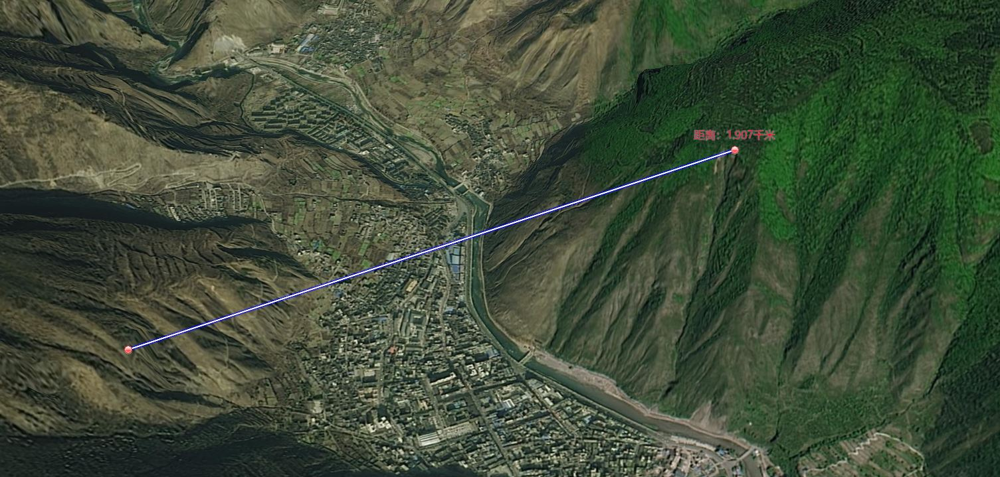
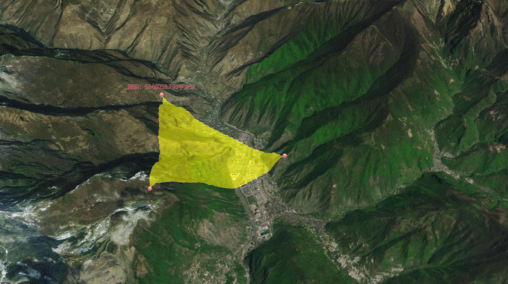

# measure

## groundLength 贴地线测量

```js
MeasureStickDis();
```



## groundArea 贴地面积测量

```js
startDrawGroundPolygon();
```



## planeLength 平面线测量

```js
startDrawGroundPolygon();
```



## planeArea 平面面积测量

```js
planeArea();
```


