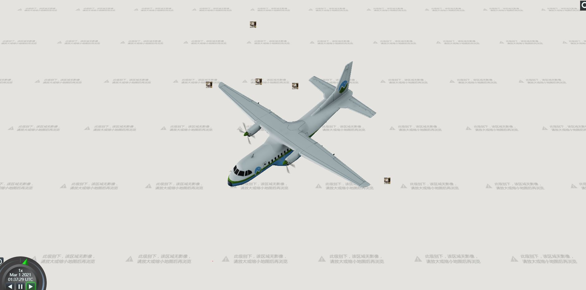

# ParticleSystem

```js
var emitterModelMatrix = new this.Cesium.Matrix4();
var translation = new this.Cesium.Cartesian3();
var rotation = new this.Cesium.Quaternion();
var hpr = new this.Cesium.HeadingPitchRoll();
var trs = new this.Cesium.TranslationRotationScale();
let computeEmitterModelMatrix = () => {
  hpr = this.Cesium.HeadingPitchRoll.fromDegrees(0.0, 0.0, 0.0, hpr);
  trs.translation = this.Cesium.Cartesian3.fromElements(
    -4.0,
    0.0,
    1.4,
    translation
  );
  trs.rotation = this.Cesium.Quaternion.fromHeadingPitchRoll(hpr, rotation);
  return this.Cesium.Matrix4.fromTranslationRotationScale(
    trs,
    emitterModelMatrix
  );
};
```

## basicParticle

```js
let entity = createEntity("model", {
  positions: [-107.0, 43.0, 0],
  uri: "http://localhost:8091/SampleData/models/CesiumAir/Cesium_Air.glb"
});
let enti = window.viewer.entities.add(entity);
window.viewer.zoomTo(enti);

let particleSystem = createParticleSystem({
  image: require("../assets/cat.jpg"),
  imageSize: new this.Cesium.Cartesian2(20, 20),
  startScale: 0.001,
  endScale: 4.0,
  particleLife: 1.0,
  speed: 5.0,
  emitter: new this.Cesium.CircleEmitter(20),
  emissionRate: 5.0,
  emitterModelMatrix: computeEmitterModelMatrix(),
  modelMatrix: enti.computeModelMatrix(
    window.viewer.clock.startTime,
    new this.Cesium.Matrix4()
  )
});
window.viewer.scene.primitives.add(particleSystem);
```



## followModel

```js
var start = this.Cesium.JulianDate.fromDate(new Date(2015, 2, 25, 16));
var stop = this.Cesium.JulianDate.addSeconds(
  start,
  120,
  new this.Cesium.JulianDate()
);
window.viewer.clock.startTime = start.clone();
window.viewer.clock.stopTime = stop.clone();
window.viewer.clock.currentTime = start.clone();
window.viewer.clock.clockRange = this.Cesium.ClockRange.LOOP_STOP; //Loop at the end
window.viewer.clock.multiplier = 1;

var pos1 = this.Cesium.Cartesian3.fromDegrees(
  -75.1633691390455,
  39.95355089912078
);
var pos2 = this.Cesium.Cartesian3.fromDegrees(
  -74.15787310614596,
  39.97862668312678
);
var position = new this.Cesium.SampledPositionProperty();
position.addSample(start, pos1);
position.addSample(stop, pos2);

let entity = {
  position: position,
  availability: new this.Cesium.TimeIntervalCollection([
    new this.Cesium.TimeInterval({
      start: start,
      stop: stop
    })
  ]),
  model: {
    uri:
      "http://localhost:8091/SampleData/models/CesiumAir/Cesium_Air.glb"
  }
};
let enti = window.viewer.entities.add(entity);
window.viewer.zoomTo(enti);
window.viewer.trackedEntity = enti;

var viewModel = {
  emissionRate: 5.0,
  gravity: 0.0,
  minimumParticleLife: 1.2,
  maximumParticleLife: 1.2,
  minimumSpeed: 1.0,
  maximumSpeed: 4.0,
  startScale: 0.001,
  endScale: 0.001,
  particleSize: 25.0
};

var gravityScratch = new this.Cesium.Cartesian3();
let applyGravity = (p, dt) => {
  var position = p.position;
  this.Cesium.Cartesian3.normalize(position, gravityScratch);
  this.Cesium.Cartesian3.multiplyByScalar(
    gravityScratch,
    viewModel.gravity * dt,
    gravityScratch
  );
  p.velocity = this.Cesium.Cartesian3.add(
    p.velocity,
    gravityScratch,
    p.velocity
  );
};

let particleSystem = createParticleSystem({
  image: require("../assets/cat.jpg"),
  imageSize: new this.Cesium.Cartesian2(
    viewModel.particleSize,
    viewModel.particleSize
  ),
  startScale: viewModel.startScale,
  endScale: viewModel.endScale,
  startColor: this.Cesium.Color.LIGHTSEAGREEN.withAlpha(0.7),
  endColor: this.Cesium.Color.WHITE.withAlpha(0.0),
  minimumParticleLife: viewModel.minimumParticleLife,
  maximumParticleLife: viewModel.maximumParticleLife,
  emitter: new this.Cesium.CircleEmitter(20),
  emissionRate: viewModel.emissionRate,
  minimumSpeed: viewModel.minimumSpeed,
  maximumSpeed: viewModel.maximumSpeed,
  lifetime: 16.0,
  updateCallback: applyGravity,
  emitterModelMatrix: computeEmitterModelMatrix(),
  modelMatrix: enti.computeModelMatrix(
    window.viewer.clock.startTime,
    new this.Cesium.Matrix4()
  )
});

let particle = window.viewer.scene.primitives.add(particleSystem);
window.viewer.scene.preUpdate.addEventListener((scene, time) => {
  particle.modelMatrix = enti.computeModelMatrix(
    time,
    new this.Cesium.Matrix4()
  );
  // Account for any changes to the emitter model matrix.
  particle.emitterModelMatrix = computeEmitterModelMatrix();
  // Spin the emitter if enabled.
  if (viewModel.spin) {
    viewModel.heading += 1.0;
    viewModel.pitch += 1.0;
    viewModel.roll += 1.0;
  }
});
```


## fireworks

```js
let scene = window.viewer.scene;
let modelMatrix = this.Cesium.Transforms.eastNorthUpToFixedFrame(
  this.Cesium.Cartesian3.fromDegrees(-75.59777, 40.03883)
);
let emitterInitialLocation = new this.Cesium.Cartesian3(0.0, 0.0, 100.0);
let particleCanvas;

// * 创建粒子
let getImage = () => {
  if (!this.Cesium.defined(particleCanvas)) {
    particleCanvas = document.createElement("canvas");
    particleCanvas.width = 20;
    particleCanvas.height = 20;
    let context2D = particleCanvas.getContext("2d");
    context2D.beginPath();
    context2D.arc(8, 8, 8, 0, this.Cesium.Math.TWO_PI, true);
    context2D.closePath();
    context2D.fillStyle = "rgb(255, 255, 255)";
    context2D.fill();
  }
  return particleCanvas;
};

let minimumExplosionSize = 30.0;
let maximumExplosionSize = 100.0;
let particlePixelSize = new this.Cesium.Cartesian2(7.0, 7.0);
let burstSize = 400.0;
let lifetime = 10.0;
let numberOfFireworks = 20.0;
let emitterModelMatrixScratch = new this.Cesium.Matrix4();

// * 创建烟花
let createFireworks = (offset, color, bursts) => {
  // * 创建粒子发射器位置
  let position = this.Cesium.Cartesian3.add(
    emitterInitialLocation,
    offset,
    emitterModelMatrixScratch
  );
  let emitterModelMatrix = this.Cesium.Matrix4.fromTranslation(
    position,
    emitterModelMatrixScratch
  );
  let particleToWorld = this.Cesium.Matrix4.multiply(
    modelMatrix,
    emitterModelMatrix,
    new this.Cesium.Matrix4()
  );
  let worldToParticle = this.Cesium.Matrix4.inverseTransformation(
    particleToWorld,
    particleToWorld
  );
  let size = this.Cesium.Math.randomBetween(
    minimumExplosionSize,
    maximumExplosionSize
  );
  let particlePositionScratch = new this.Cesium.Cartesian3();
  let force = particle => {
    let position = this.Cesium.Matrix4.multiplyByPoint(
      worldToParticle,
      particle.position,
      particlePositionScratch
    );
    if (
      this.Cesium.Cartesian3.magnitudeSquared(position) >=
      size * size
    ) {
      this.Cesium.Cartesian3.clone(
        this.Cesium.Cartesian3.ZERO,
        particle.velocity
      );
    }
  };
  let normalSize =
    (size - minimumExplosionSize) /
    (maximumExplosionSize - minimumExplosionSize);
  let minLife = 0.3;
  let maxLife = 1.0;
  let life = normalSize * (maxLife - minLife) + minLife;
  scene.primitives.add(
    createParticleSystem({
      image: getImage(),
      startColor: color,
      endColor: color.withAlpha(0.0),
      particleLife: life,
      speed: 100.0,
      imageSize: particlePixelSize,
      emissionRate: 0,
      emitter: new this.Cesium.SphereEmitter(0.1),
      bursts: bursts,
      lifetime: lifetime,
      updateCallback: force,
      modelMatrix: modelMatrix,
      emitterModelMatrix: emitterModelMatrix
    })
  );
};

let xMin = -100.0;
let xMax = 100.0;
let yMin = -80.0;
let yMax = 100.0;
let zMin = -50.0;
let zMax = 50.0;
let colorOptions = [
  {
    minimumRed: 0.75,
    green: 0.0,
    minimumBlue: 0.8,
    alpha: 1.0
  },
  {
    red: 0.0,
    minimumGreen: 0.75,
    minimumBlue: 0.8,
    alpha: 1.0
  },
  {
    red: 0.0,
    green: 0.0,
    minimumBlue: 0.8,
    alpha: 1.0
  },
  {
    minimumRed: 0.75,
    minimumGreen: 0.75,
    blue: 0.0,
    alpha: 1.0
  }
];

for (let i = 0; i < numberOfFireworks; ++i) {
  let x = this.Cesium.Math.randomBetween(xMin, xMax);
  let y = this.Cesium.Math.randomBetween(yMin, yMax);
  let z = this.Cesium.Math.randomBetween(zMin, zMax);
  let offset = new this.Cesium.Cartesian3(x, y, z);
  let color = this.Cesium.Color.fromRandom(
    colorOptions[i % colorOptions.length]
  );
  let bursts = [];
  for (let j = 0; j < 3; ++j) {
    bursts.push(
      new this.Cesium.ParticleBurst({
        time: this.Cesium.Math.nextRandomNumber() * lifetime,
        minimum: burstSize,
        maximum: burstSize
      })
    );
  }
  createFireworks(offset, color, bursts);
}

let cam = window.viewer.scene.camera;
let cameraOffset = new this.Cesium.Cartesian3(-300.0, 0.0, 0.0);
cam.lookAtTransform(modelMatrix, cameraOffset);
cam.lookAtTransform(this.Cesium.Matrix4.IDENTITY);
let toFireworks = this.Cesium.Cartesian3.subtract(
  emitterInitialLocation,
  cameraOffset,
  new this.Cesium.Cartesian3()
);
this.Cesium.Cartesian3.normalize(toFireworks, toFireworks);
let angle =
  this.Cesium.Math.PI_OVER_TWO -
  Math.acos(
    this.Cesium.Cartesian3.dot(toFireworks, this.Cesium.Cartesian3.UNIT_Z)
  );
cam.lookUp(angle);
```


## snow

```js
let scene = window.viewer.scene;

scene.camera.setView({
  destination: new this.Cesium.Cartesian3(
    277096.634865404,
    5647834.481964232,
    2985563.7039122293
  ),
  orientation: {
    heading: 4.731089976107251,
    pitch: -0.32003481981370063
  }
});

// * 雪
let snowParticleSize = 12.0;
let snowRadius = 100000.0;
let minimumSnowImageSize = new this.Cesium.Cartesian2(
  snowParticleSize,
  snowParticleSize
);
let maximumSnowImageSize = new this.Cesium.Cartesian2(
  snowParticleSize * 2.0,
  snowParticleSize * 2.0
);
let snowGravityScratch = new this.Cesium.Cartesian3();
let snowSystem;
let snowUpdate = particle => {
  snowGravityScratch = this.Cesium.Cartesian3.normalize(
    particle.position,
    snowGravityScratch
  );
  this.Cesium.Cartesian3.multiplyByScalar(
    snowGravityScratch,
    this.Cesium.Math.randomBetween(-30.0, -300.0),
    snowGravityScratch
  );
  particle.velocity = this.Cesium.Cartesian3.add(
    particle.velocity,
    snowGravityScratch,
    particle.velocity
  );
  let distance = this.Cesium.Cartesian3.distance(
    scene.camera.position,
    particle.position
  );
  if (distance > snowRadius) {
    particle.endColor.alpha = 0.0;
  } else {
    particle.endColor.alpha =
      snowSystem.endColor.alpha / (distance / snowRadius + 0.1);
  }
};
snowSystem = createParticleSystem({
  modelMatrix: new this.Cesium.Matrix4.fromTranslation(
    scene.camera.position
  ),
  minimumSpeed: -1.0,
  maximumSpeed: 0.0,
  lifetime: 15.0,
  emitter: new this.Cesium.SphereEmitter(snowRadius),
  startScale: 0.5,
  endScale: 1.0,
  image: "http://localhost:8091/SampleData/snowflake_particle.png",
  emissionRate: 7000.0,
  startColor: this.Cesium.Color.WHITE.withAlpha(0.0),
  endColor: this.Cesium.Color.WHITE.withAlpha(1.0),
  minimumImageSize: minimumSnowImageSize,
  maximumImageSize: maximumSnowImageSize,
  updateCallback: snowUpdate
});
scene.primitives.add(snowSystem);
```


## rain

```js
let scene = window.viewer.scene;

scene.camera.setView({
  destination: new this.Cesium.Cartesian3(
    277096.634865404,
    5647834.481964232,
    2985563.7039122293
  ),
  orientation: {
    heading: 4.731089976107251,
    pitch: -0.32003481981370063
  }
});

// * 雨
let rainParticleSize = 15.0;
let rainRadius = 100000.0;
let rainImageSize = new this.Cesium.Cartesian2(
  rainParticleSize,
  rainParticleSize * 2.0
);
let rainGravityScratch = new this.Cesium.Cartesian3();
let rainSystem;
let rainUpdate = particle => {
  rainGravityScratch = this.Cesium.Cartesian3.normalize(
    particle.position,
    rainGravityScratch
  );
  this.Cesium.Cartesian3.multiplyByScalar(
    rainGravityScratch,
    -1050.0,
    rainGravityScratch
  );
  particle.velocity = this.Cesium.Cartesian3.add(
    particle.velocity,
    rainGravityScratch,
    particle.velocity
  );
  let distance = this.Cesium.Cartesian3.distance(
    scene.camera.position,
    particle.position
  );
  if (distance > rainRadius) {
    particle.endColor.alpha = 0.0;
  } else {
    particle.endColor.alpha =
      rainSystem.endColor.alpha / (distance / rainRadius + 0.1);
  }
};
rainSystem = createParticleSystem({
  modelMatrix: new this.Cesium.Matrix4.fromTranslation(
    scene.camera.position
  ),
  minimumSpeed: -1.0,
  maximumSpeed: 0.0,
  lifetime: 15.0,
  emitter: new this.Cesium.SphereEmitter(rainRadius),
  startScale: 1.0,
  endScale: 0.0,
  image: "http://localhost:8091/SampleData/circular_particle.png",
  emissionRate: 7000.0,
  startColor: new this.Cesium.Color(0.27, 0.5, 0.7, 0.0),
  endColor: new this.Cesium.Color(0.27, 0.5, 0.7, 0.98),
  imageSize: rainImageSize,
  updateCallback: rainUpdate
});
scene.primitives.add(rainSystem);
```


