# primitive

## box

```js
let geometry = createPrimitve("box", {
  dimensions: [400000.0, 300000.0, 500000.0],
  modelMatrix: [-105.0, 45.0]
});

appearance: new this.Cesium.PerInstanceColorAppearance({
  flat: true,
  translucent: false
})
```

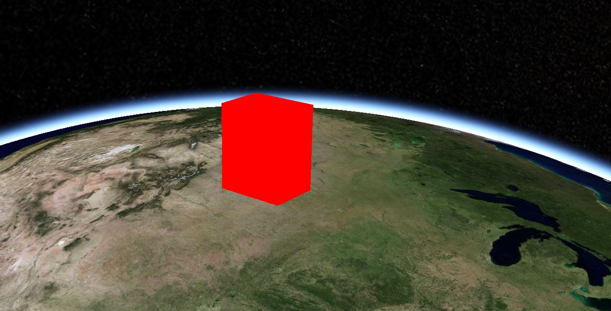

## boxoutline

```js
let geometry = createPrimitve("boxOutline", {
  dimensions: [400000.0, 300000.0, 500000.0],
  modelMatrix: [-105.0, 45.0]
});

appearance: new this.Cesium.PerInstanceColorAppearance({
  flat: true,
  translucent: false,
  renderState: {
    lineWidth: Math.min(
      6.0,
      window.viewer.scene.maximumAliasedLineWidth
    )
  }
})
```

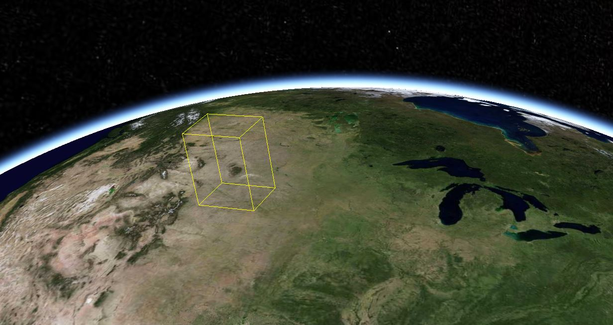

## circle

```js
let geometry = createPrimitve("circle", {
  center: [-75.59777, 40.03883],
  radius: 100000.0
});

appearance: new this.Cesium.EllipsoidSurfaceAppearance({
  material: this.Cesium.Material.fromType("Stripe")
})
```

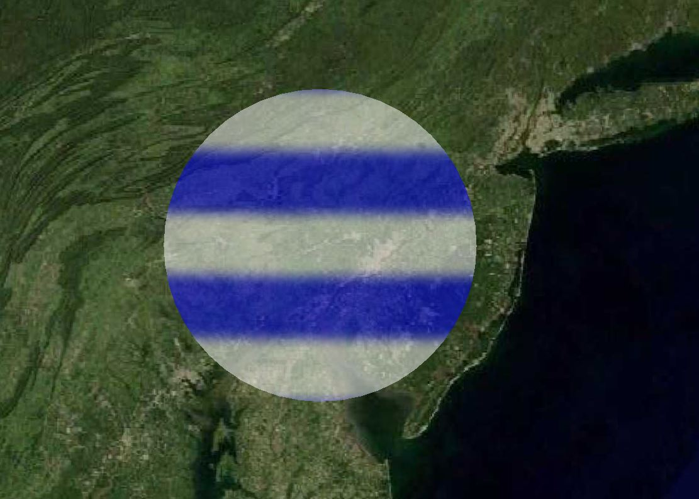

## circleoutline

```js
let geometry = createPrimitve("circleOutline", {
  center: [-75.59777, 40.03883],
  radius: 100000.0
});

appearance: new this.Cesium.PerInstanceColorAppearance({
  flat: true,
  translucent: false,
  renderState: {
    lineWidth: Math.min(
      6.0,
      window.viewer.scene.maximumAliasedLineWidth
    )
  }
})
```

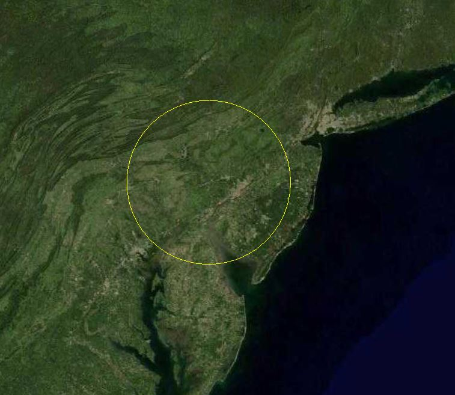

## coplanarPolygon

```js
let geometry = createPrimitve("coplanarPolygon", {
  polygonHierarchy: [
    -90.0,
    30.0,
    0.0,
    -90.0,
    30.0,
    300000.0,
    -80.0,
    30.0,
    300000.0,
    -80.0,
    30.0,
    0.0
  ]
});

appearance: new this.Cesium.EllipsoidSurfaceAppearance({
  material: this.Cesium.Material.fromType("Stripe")
})
```


## coplanarPolygonOutline

```js
let geometry = createPrimitve("coplanarPolygonOutline", {
  polygonHierarchy: [
    -90.0,
    30.0,
    0.0,
    -90.0,
    30.0,
    300000.0,
    -80.0,
    30.0,
    300000.0,
    -80.0,
    30.0,
    0.0
  ]
});

appearance: new this.Cesium.PerInstanceColorAppearance({
  flat: true,
  translucent: false,
  renderState: {
    lineWidth: Math.min(
      6.0,
      window.viewer.scene.maximumAliasedLineWidth
    )
  }
})
```

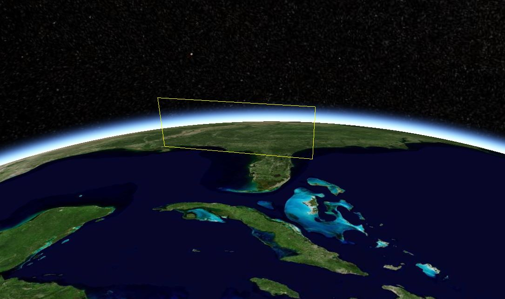

## corridor

```js
let geometry = createPrimitve("corridor", {
  positions: [-72.0, 40.0, -70.0, 35.0, -75.59777, 40.03883],
  width: 100000,
  extrudedHeight: 100000
});

appearance: new this.Cesium.PerInstanceColorAppearance({
  flat: true,
  translucent: false,
  renderState: {
    lineWidth: Math.min(
      6.0,
      window.viewer.scene.maximumAliasedLineWidth
    )
  }
})
```

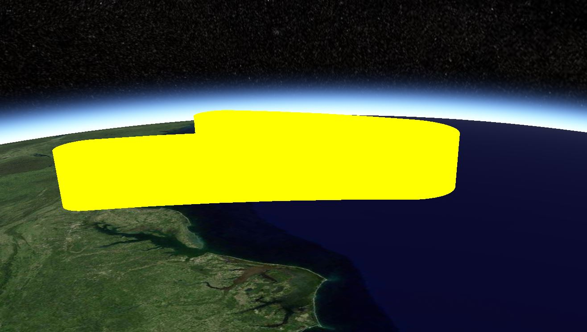

## corridorOutline

```js
let geometry = createPrimitve("corridorOutline", {
  positions: [-72.0, 40.0, -70.0, 35.0, -75.59777, 40.03883],
  width: 100000,
  extrudedHeight: 100000
});

appearance: new this.Cesium.PerInstanceColorAppearance({
  flat: true,
  translucent: false,
  renderState: {
    lineWidth: Math.min(
      6.0,
      window.viewer.scene.maximumAliasedLineWidth
    )
  }
})
```

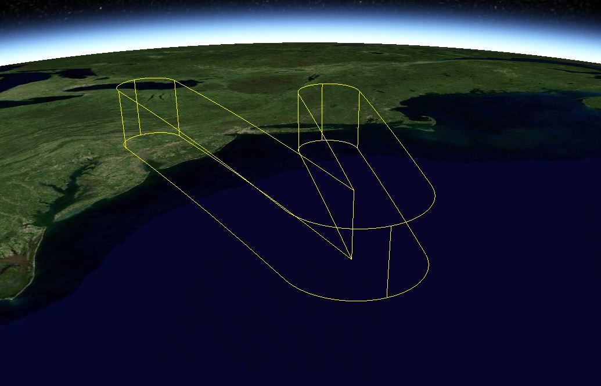

## cylinder

```js
let geometry = createPrimitve("cylinder", {
  length: 200000,
  topRadius: 80000,
  bottomRadius: 200000,
  modelMatrix: [-105.0, 45.0]
});

appearance: new this.Cesium.EllipsoidSurfaceAppearance({
  material: this.Cesium.Material.fromType("Stripe")
})
```

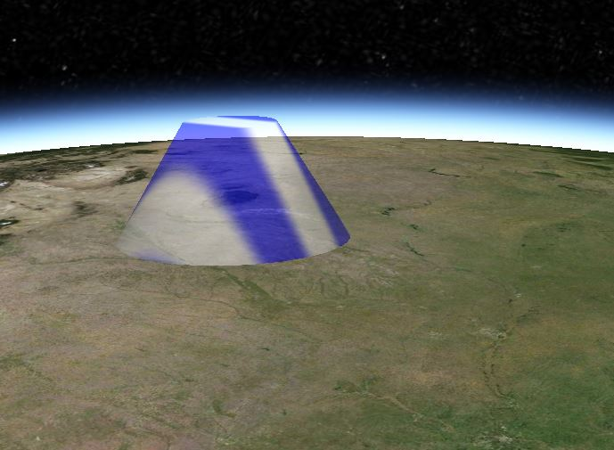

## cylinderOutline

```js
let geometry = createPrimitve("cylinderOutline", {
  length: 200000,
  topRadius: 80000,
  bottomRadius: 200000,
  modelMatrix: [-105.0, 45.0]
});

appearance: new this.Cesium.PerInstanceColorAppearance({
  flat: true,
  translucent: false,
  renderState: {
    lineWidth: Math.min(
      6.0,
      window.viewer.scene.maximumAliasedLineWidth
    )
  }
})
```

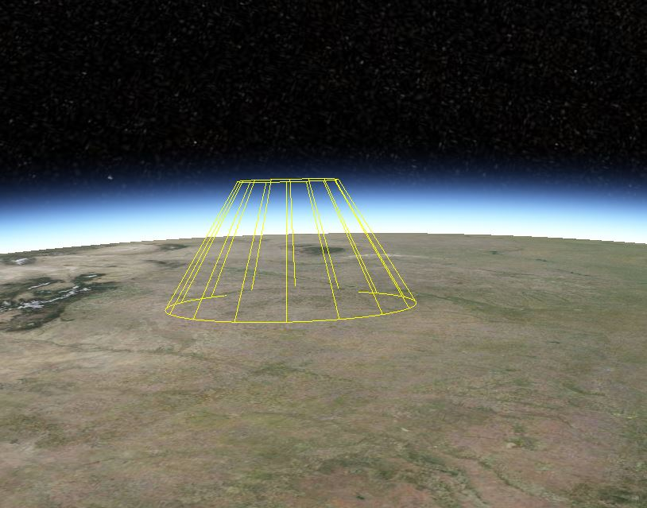

## ellipse

```js
let geometry = createPrimitve("ellipse", {
  center: [-75.59777, 40.03883],
  semiMajorAxis: 500000.0,
  semiMinorAxis: 300000.0,
  extrudedHeight: 100000
});

appearance: new this.Cesium.EllipsoidSurfaceAppearance({
  material: this.Cesium.Material.fromType("Stripe")
})
```

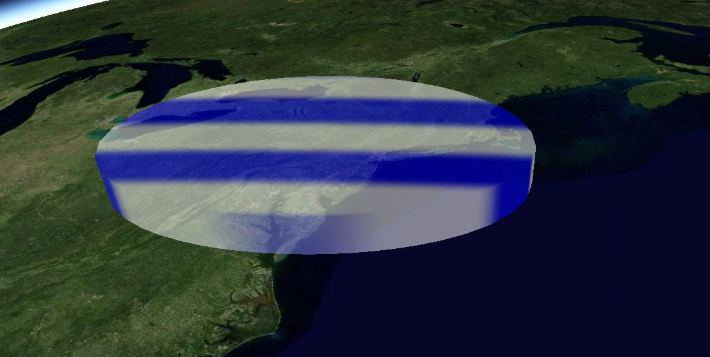

## ellipseOutline

```js
let geometry = createPrimitve("ellipseOutline", {
  center: [-75.59777, 40.03883],
  semiMajorAxis: 500000.0,
  semiMinorAxis: 300000.0,
  extrudedHeight: 100000
});

appearance: new this.Cesium.PerInstanceColorAppearance({
  flat: true,
  translucent: false,
  renderState: {
    lineWidth: Math.min(
      6.0,
      window.viewer.scene.maximumAliasedLineWidth
    )
  }
})
```

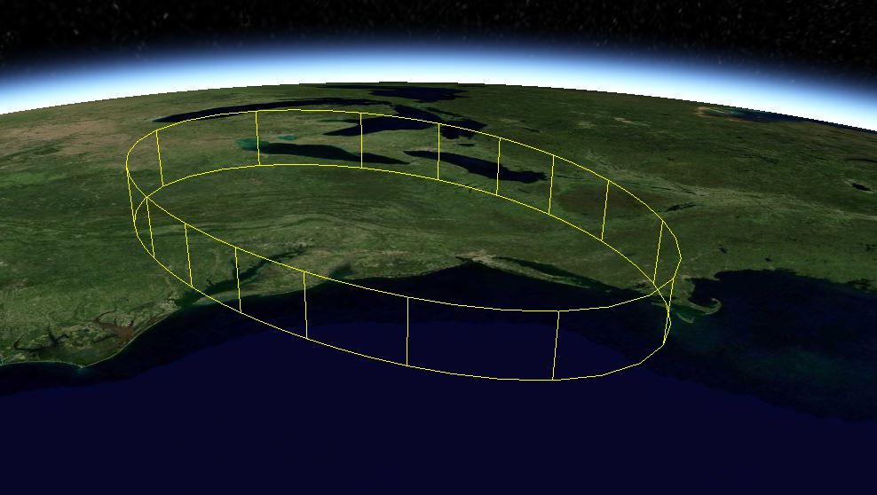

## ellipsoid

```js
let geometry = createPrimitve("ellipsoid", {
  radii: [1000000.0, 500000.0, 500000.0],
  modelMatrix: [-105.0, 45.0]
});

appearance: new this.Cesium.PerInstanceColorAppearance({
  flat: true,
  translucent: false,
  renderState: {
    lineWidth: Math.min(
      6.0,
      window.viewer.scene.maximumAliasedLineWidth
    )
  }
})
```

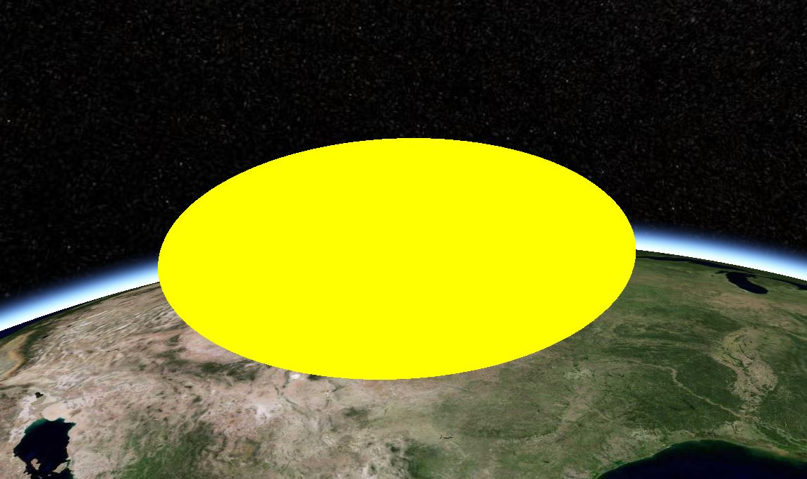

## ellipsoidOutline

```js
let geometry = createPrimitve("ellipsoidOutline", {
  radii: [1000000.0, 500000.0, 500000.0],
  modelMatrix: [-105.0, 45.0]
});

appearance: new this.Cesium.PerInstanceColorAppearance({
  flat: true,
  translucent: false,
  renderState: {
    lineWidth: Math.min(
      6.0,
      window.viewer.scene.maximumAliasedLineWidth
    )
  }
})
```

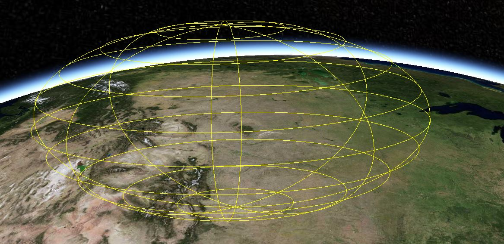

## frustum

```js
let geometry = createPrimitve("frustum", {
  origin: [-105.0, 45.0]
});

appearance: new this.Cesium.PerInstanceColorAppearance({
  flat: true,
  translucent: false,
  renderState: {
    lineWidth: Math.min(
      6.0,
      window.viewer.scene.maximumAliasedLineWidth
    )
  }
})
```

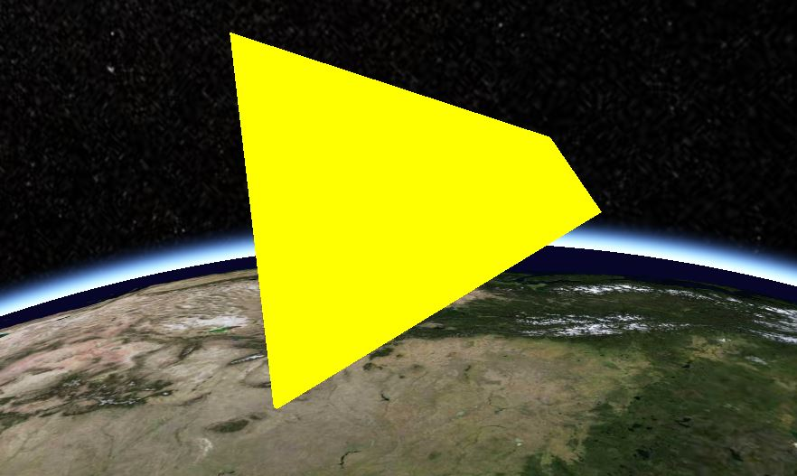

## frustumOutline

```js
let geometry = createPrimitve("frustumOutline", {
  origin: [-105.0, 45.0]
});

appearance: new this.Cesium.PerInstanceColorAppearance({
  flat: true,
  translucent: false,
  renderState: {
    lineWidth: Math.min(
      6.0,
      window.viewer.scene.maximumAliasedLineWidth
    )
  }
})
```

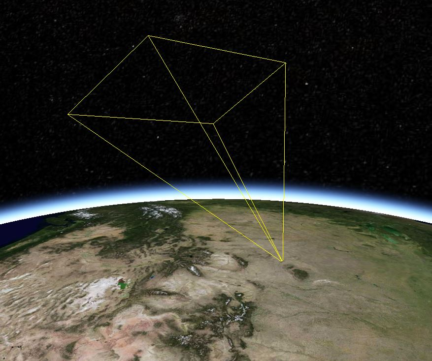

## plane

```js
let geometry = createPrimitve("plane", {
  modelMatrix: [-105.0, 45.0],
  long: 100000.0,
  width: 200000.0
});

appearance: new this.Cesium.EllipsoidSurfaceAppearance({
  material: this.Cesium.Material.fromType("Stripe")
})
```

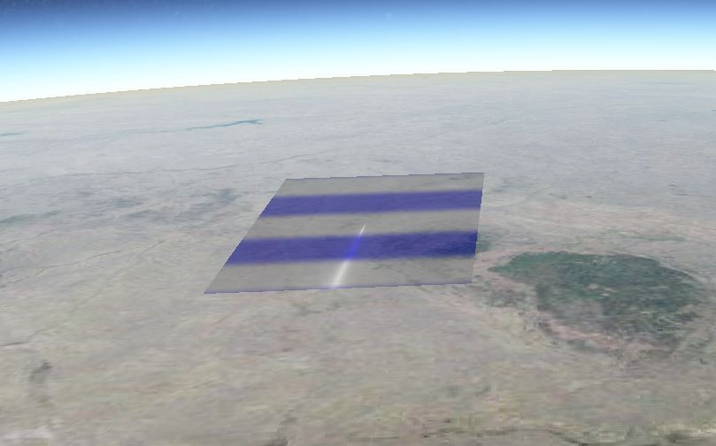

## planeOutline

```js
let geometry = createPrimitve("planeOutline", {
  modelMatrix: [-105.0, 45.0],
  long: 100000.0,
  width: 200000.0
});

appearance: new this.Cesium.EllipsoidSurfaceAppearance({
  material: this.Cesium.Material.fromType("Stripe")
})
```

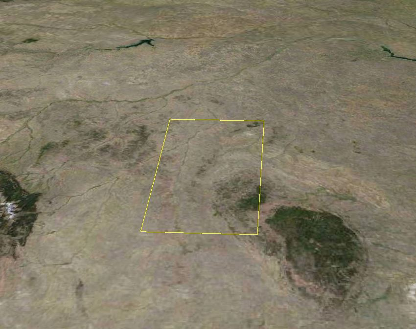

## polygon

```js
let geometry = createPrimitve("polygon", {
  polygonHierarchy: [
    -72.0,
    40.0,
    -70.0,
    35.0,
    -75.0,
    30.0,
    -70.0,
    30.0,
    -68.0,
    40.0
  ],
  extrudedHeight: 1000000.0
});

appearance: new this.Cesium.EllipsoidSurfaceAppearance({
  material: this.Cesium.Material.fromType("Stripe")
})
```

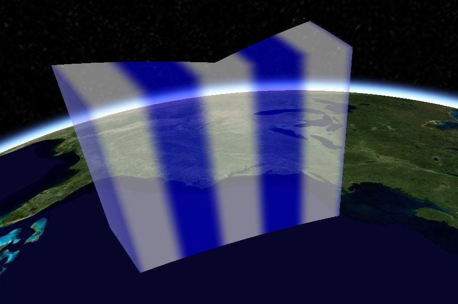

## polygonOutline

```js
let geometry = createPrimitve("polygonOutline", {
  polygonHierarchy: [
    -72.0,
    40.0,
    -70.0,
    35.0,
    -75.0,
    30.0,
    -70.0,
    30.0,
    -68.0,
    40.0
  ],
  extrudedHeight: 1000000.0
});

appearance: new this.Cesium.EllipsoidSurfaceAppearance({
  material: this.Cesium.Material.fromType("Stripe")
})
```

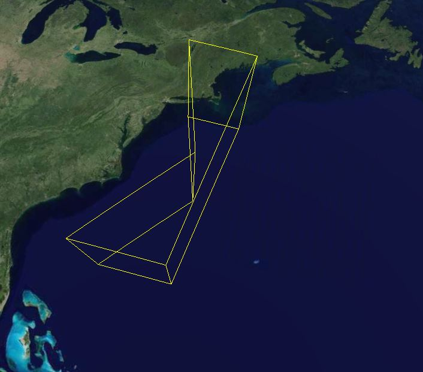

## polyline

```js
let geometry = createPrimitve("polyline", {
  positions: [-80.0, 39.0, -74.0, 42.0],
  width: 10.0
});

appearance: new this.Cesium.PolylineColorAppearance({
  translucent: false
})
```

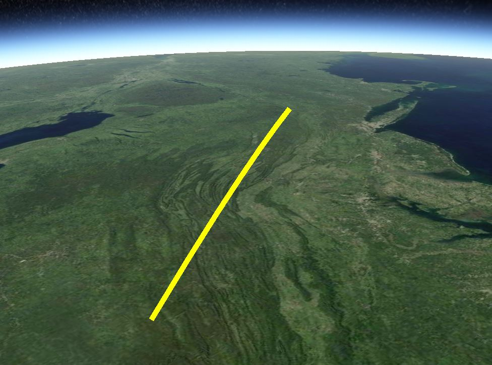

## simplePolyline

```js
let geometry = createPrimitve("simplePolyline", {
  positions: [-80.0, 39.0, -74.0, 42.0, -72.0, 40.0]
});

appearance: new this.Cesium.PerInstanceColorAppearance({
  flat: true,
  translucent: false,
  renderState: {
    lineWidth: Math.min(
      6.0,
      window.viewer.scene.maximumAliasedLineWidth
    )
  }
})
```


## rectangle

```js
let geometry = createPrimitve("rectangle", {
  rectangle: [-80.0, 39.0, -74.0, 42.0],
  extrudedHeight: 1000000.0
});

appearance: new this.Cesium.EllipsoidSurfaceAppearance({
  material: this.Cesium.Material.fromType("Stripe")
})
```

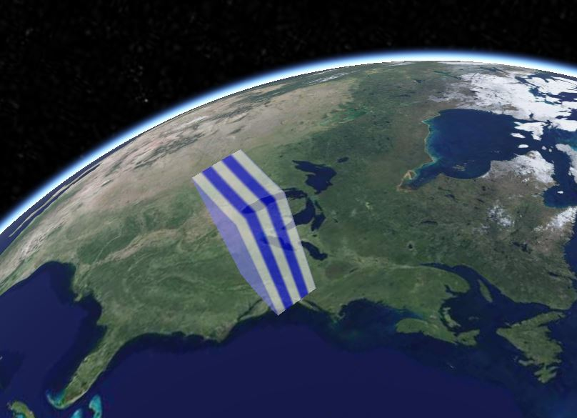

## rectangleOutline

```js
let geometry = createPrimitve("rectangleOutline", {
  rectangle: [-80.0, 39.0, -74.0, 42.0],
  extrudedHeight: 1000000.0
});

appearance: new this.Cesium.PerInstanceColorAppearance({
  flat: true,
  translucent: false,
  renderState: {
    lineWidth: Math.min(
      6.0,
      window.viewer.scene.maximumAliasedLineWidth
    )
  }
})
```

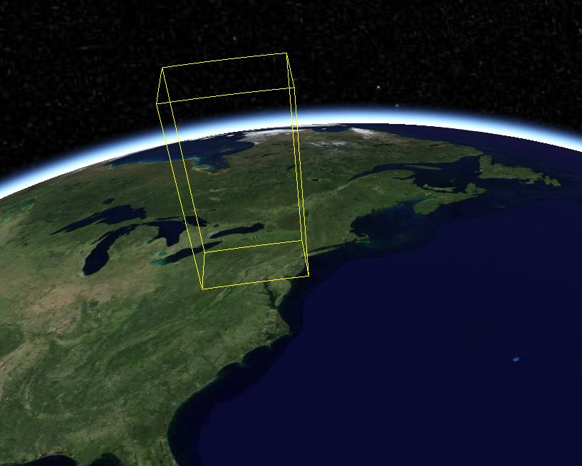

## sphere

```js
let geometry = createPrimitve("sphere", {
  radius: 1.0,
  modelMatrix: [-80.0, 39.0]
});

appearance: new this.Cesium.EllipsoidSurfaceAppearance({
  material: this.Cesium.Material.fromType("Stripe")
})
```

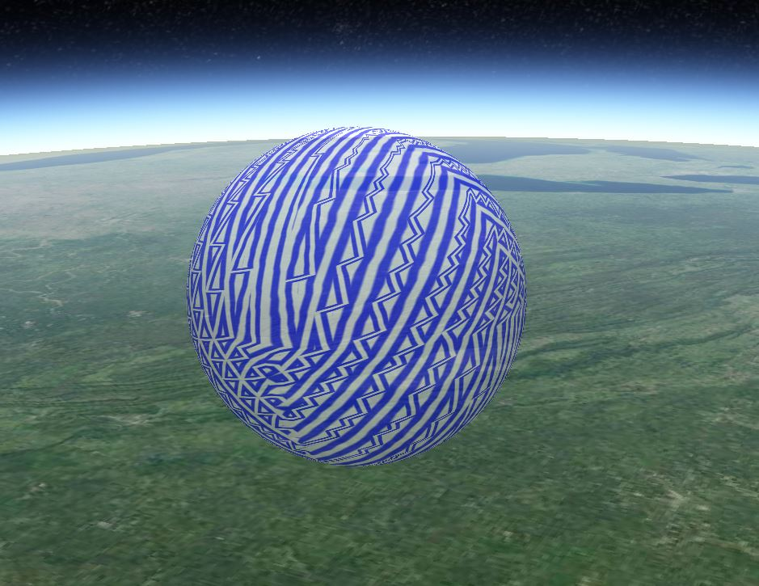

## sphereOutline

```js
let geometry = createPrimitve("sphereOutline", {
  radius: 1.0
});

appearance: new this.Cesium.PerInstanceColorAppearance({
  flat: true,
  translucent: false,
  renderState: {
    lineWidth: Math.min(
      6.0,
      window.viewer.scene.maximumAliasedLineWidth
    )
  }
})
```

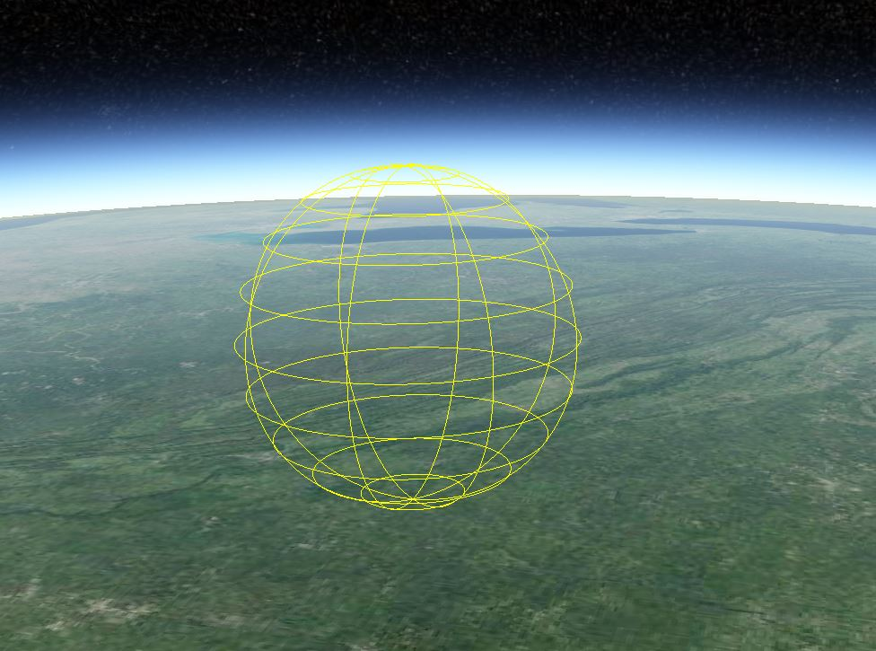

## wall

```js
let geometry = createPrimitve("wall", {
  positions: [-95.0, 50.0, -85.0, 50.0, -75.0, 50.0],
  maximumHeights: [500000, 1000000, 500000],
  minimumHeights: [0, 500000, 0]
});

appearance: new this.Cesium.EllipsoidSurfaceAppearance({
  material: this.Cesium.Material.fromType("Stripe")
})
```

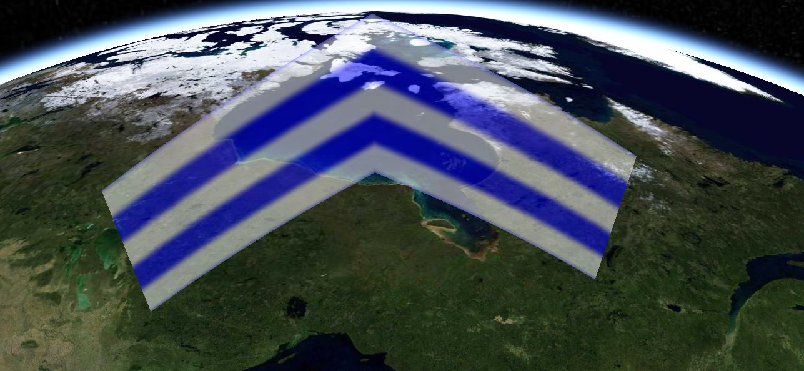

## wallOutline

```js
let geometry = createPrimitve("wallOutline", {
  positions: [-95.0, 50.0, -85.0, 50.0, -75.0, 50.0],
  maximumHeights: [500000, 1000000, 500000],
  minimumHeights: [0, 500000, 0]
});

appearance: new this.Cesium.PerInstanceColorAppearance({
  flat: true,
  translucent: false,
  renderState: {
    lineWidth: Math.min(
      6.0,
      window.viewer.scene.maximumAliasedLineWidth
    )
  }
})
```

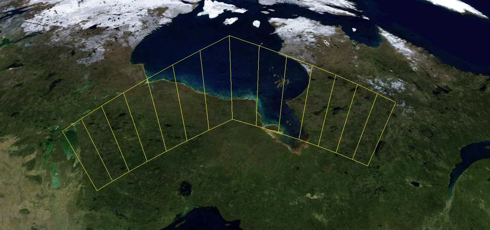

## 3dtile

```js
let primitive = createPrimitve("3dTile", {
  url: "http://localhost:8091/cz/tileset.json"
});
let pri = window.viewer.scene.primitives.add(primitive);
window.viewer.zoomTo(pri);
```

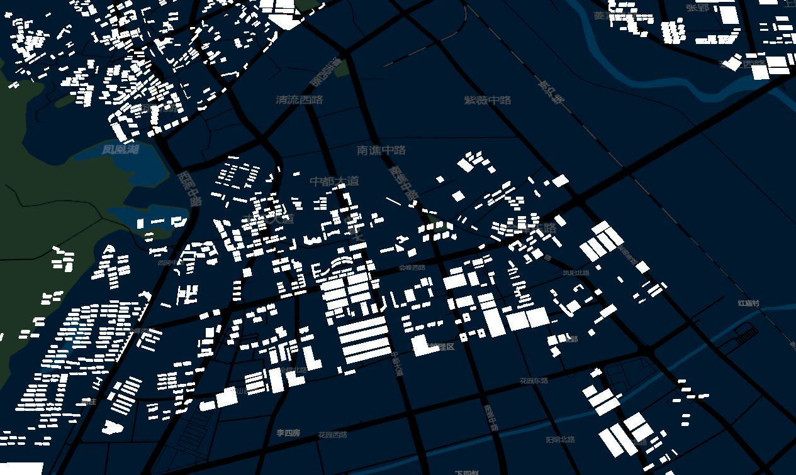
