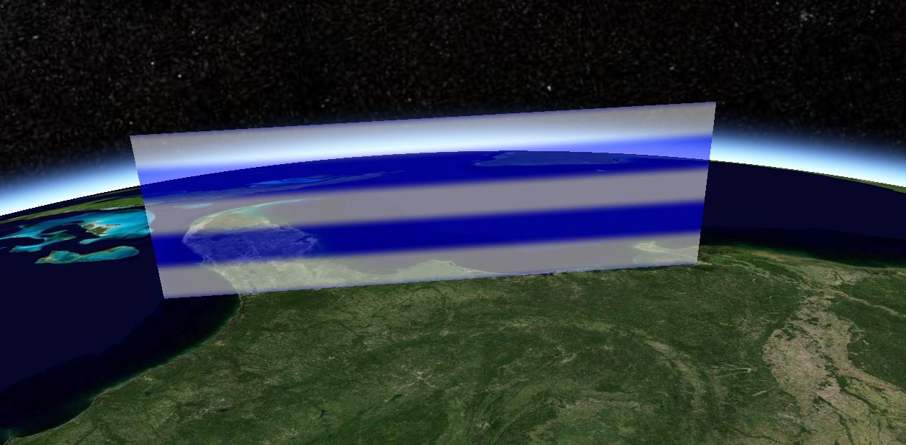

# primitive

## box

```js
let geometry = createPrimitve("box", {
  dimensions: [400000.0, 300000.0, 500000.0],
  modelMatrix: [-105.0, 45.0]
});

appearance: new this.Cesium.PerInstanceColorAppearance({
  flat: true,
  translucent: false
})
```


## boxoutline

```js
let geometry = createPrimitve("boxOutline", {
  dimensions: [400000.0, 300000.0, 500000.0],
  modelMatrix: [-105.0, 45.0]
});

appearance: new this.Cesium.PerInstanceColorAppearance({
  flat: true,
  translucent: false,
  renderState: {
    lineWidth: Math.min(
      6.0,
      window.viewer.scene.maximumAliasedLineWidth
    )
  }
})
```


## circle

```js
let geometry = createPrimitve("circle", {
  center: [-75.59777, 40.03883],
  radius: 100000.0
});

appearance: new this.Cesium.EllipsoidSurfaceAppearance({
  material: this.Cesium.Material.fromType("Stripe")
})
```


## circleoutline

```js
let geometry = createPrimitve("circleOutline", {
  center: [-75.59777, 40.03883],
  radius: 100000.0
});

appearance: new this.Cesium.PerInstanceColorAppearance({
  flat: true,
  translucent: false,
  renderState: {
    lineWidth: Math.min(
      6.0,
      window.viewer.scene.maximumAliasedLineWidth
    )
  }
})
```


## coplanarPolygon

```js
let geometry = createPrimitve("coplanarPolygon", {
  polygonHierarchy: [
    -90.0,
    30.0,
    0.0,
    -90.0,
    30.0,
    300000.0,
    -80.0,
    30.0,
    300000.0,
    -80.0,
    30.0,
    0.0
  ]
});

appearance: new this.Cesium.EllipsoidSurfaceAppearance({
  material: this.Cesium.Material.fromType("Stripe")
})
```



## coplanarPolygonOutline

```js
let geometry = createPrimitve("coplanarPolygonOutline", {
  polygonHierarchy: [
    -90.0,
    30.0,
    0.0,
    -90.0,
    30.0,
    300000.0,
    -80.0,
    30.0,
    300000.0,
    -80.0,
    30.0,
    0.0
  ]
});

appearance: new this.Cesium.PerInstanceColorAppearance({
  flat: true,
  translucent: false,
  renderState: {
    lineWidth: Math.min(
      6.0,
      window.viewer.scene.maximumAliasedLineWidth
    )
  }
})
```


## corridor

```js
let geometry = createPrimitve("corridor", {
  positions: [-72.0, 40.0, -70.0, 35.0, -75.59777, 40.03883],
  width: 100000,
  extrudedHeight: 100000
});

appearance: new this.Cesium.PerInstanceColorAppearance({
  flat: true,
  translucent: false,
  renderState: {
    lineWidth: Math.min(
      6.0,
      window.viewer.scene.maximumAliasedLineWidth
    )
  }
})
```


## corridorOutline

```js
let geometry = createPrimitve("corridorOutline", {
  positions: [-72.0, 40.0, -70.0, 35.0, -75.59777, 40.03883],
  width: 100000,
  extrudedHeight: 100000
});

appearance: new this.Cesium.PerInstanceColorAppearance({
  flat: true,
  translucent: false,
  renderState: {
    lineWidth: Math.min(
      6.0,
      window.viewer.scene.maximumAliasedLineWidth
    )
  }
})
```


## cylinder

```js
let geometry = createPrimitve("cylinder", {
  length: 200000,
  topRadius: 80000,
  bottomRadius: 200000,
  modelMatrix: [-105.0, 45.0]
});

appearance: new this.Cesium.EllipsoidSurfaceAppearance({
  material: this.Cesium.Material.fromType("Stripe")
})
```


## cylinderOutline

```js
let geometry = createPrimitve("cylinderOutline", {
  length: 200000,
  topRadius: 80000,
  bottomRadius: 200000,
  modelMatrix: [-105.0, 45.0]
});

appearance: new this.Cesium.PerInstanceColorAppearance({
  flat: true,
  translucent: false,
  renderState: {
    lineWidth: Math.min(
      6.0,
      window.viewer.scene.maximumAliasedLineWidth
    )
  }
})
```


## ellipse

```js
let geometry = createPrimitve("ellipse", {
  center: [-75.59777, 40.03883],
  semiMajorAxis: 500000.0,
  semiMinorAxis: 300000.0,
  extrudedHeight: 100000
});

appearance: new this.Cesium.EllipsoidSurfaceAppearance({
  material: this.Cesium.Material.fromType("Stripe")
})
```


## ellipseOutline

```js
let geometry = createPrimitve("ellipseOutline", {
  center: [-75.59777, 40.03883],
  semiMajorAxis: 500000.0,
  semiMinorAxis: 300000.0,
  extrudedHeight: 100000
});

appearance: new this.Cesium.PerInstanceColorAppearance({
  flat: true,
  translucent: false,
  renderState: {
    lineWidth: Math.min(
      6.0,
      window.viewer.scene.maximumAliasedLineWidth
    )
  }
})
```


## ellipsoid

```js
let geometry = createPrimitve("ellipsoid", {
  radii: [1000000.0, 500000.0, 500000.0],
  modelMatrix: [-105.0, 45.0]
});

appearance: new this.Cesium.PerInstanceColorAppearance({
  flat: true,
  translucent: false,
  renderState: {
    lineWidth: Math.min(
      6.0,
      window.viewer.scene.maximumAliasedLineWidth
    )
  }
})
```


## ellipsoidOutline

```js
let geometry = createPrimitve("ellipsoidOutline", {
  radii: [1000000.0, 500000.0, 500000.0],
  modelMatrix: [-105.0, 45.0]
});

appearance: new this.Cesium.PerInstanceColorAppearance({
  flat: true,
  translucent: false,
  renderState: {
    lineWidth: Math.min(
      6.0,
      window.viewer.scene.maximumAliasedLineWidth
    )
  }
})
```


## frustum

```js
let geometry = createPrimitve("frustum", {
  origin: [-105.0, 45.0]
});

appearance: new this.Cesium.PerInstanceColorAppearance({
  flat: true,
  translucent: false,
  renderState: {
    lineWidth: Math.min(
      6.0,
      window.viewer.scene.maximumAliasedLineWidth
    )
  }
})
```


## frustumOutline

```js
let geometry = createPrimitve("frustumOutline", {
  origin: [-105.0, 45.0]
});

appearance: new this.Cesium.PerInstanceColorAppearance({
  flat: true,
  translucent: false,
  renderState: {
    lineWidth: Math.min(
      6.0,
      window.viewer.scene.maximumAliasedLineWidth
    )
  }
})
```


