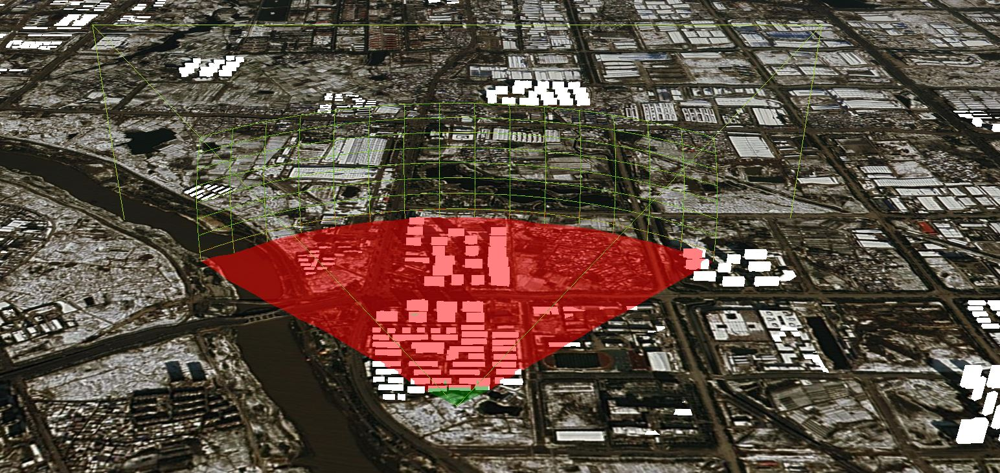

# viewshedAnalysis

## viewshedAnalysis 只适用于Cesium3DTileset

```js
let primitive = createPrimitve("3dTile", {
  url: "http://localhost:8091/cz/tileset.json"
});
let pri = window.viewer.scene.primitives.add(primitive);
window.viewer.zoomTo(pri);
window.viewer.scene.globe.depthTestAgainstTerrain = true;
window.viewer.scene.globe.enableLighting = true;
let drawHandler = new this.Cesium.ScreenSpaceEventHandler(
  window.viewer.scene.canvas
);
// * 监测鼠标左击事件
drawHandler.setInputAction(event => {
  let position = event.position;
  if (!this.Cesium.defined(position)) return;
  let ray = window.viewer.camera.getPickRay(position);
  if (!this.Cesium.defined(ray)) return;
  let cartesian = window.viewer.scene.globe.pick(ray, window.viewer.scene);
  if (!this.Cesium.defined(cartesian)) return;
  new ViewShedStage(window.viewer, {
    viewPosition: cartesian,
    viewDistance: 1000
  });
}, this.Cesium.ScreenSpaceEventType.LEFT_CLICK);
```


